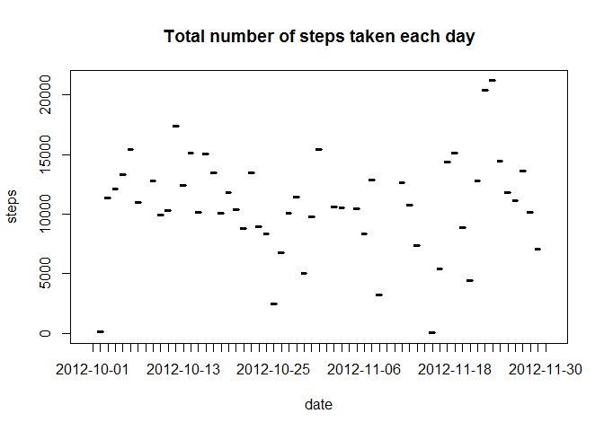
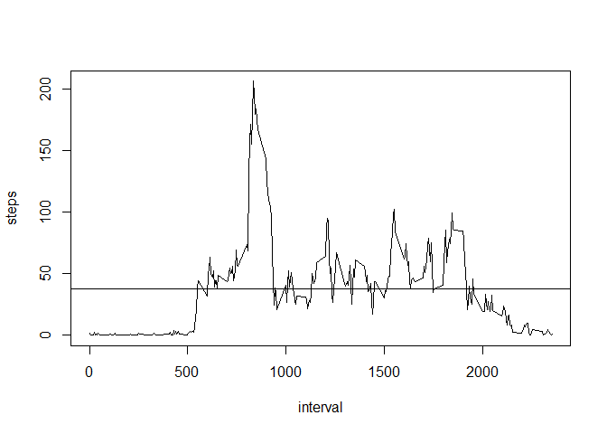
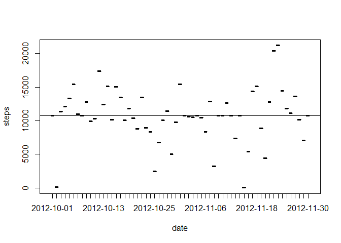
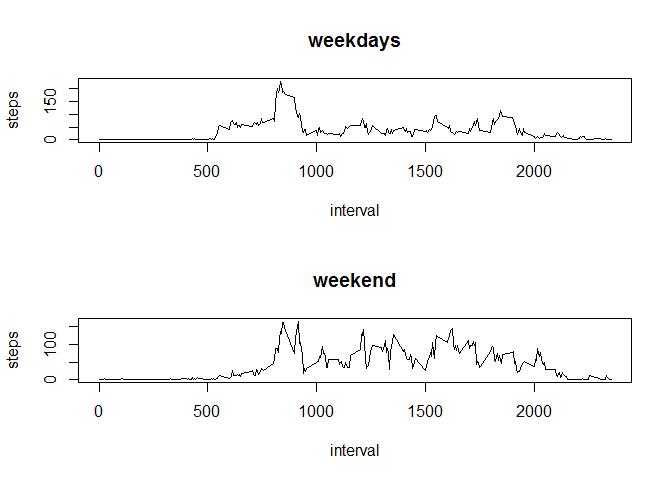

# Reproducible Research: Peer Assessment 1


## Loading and preprocessing the data

```r
        library(plyr)
        library(ggplot2)
        library(knitr)
        library(reshape2)
        
        activity <- read.csv("./activity/activity.csv")
```


## What is mean total number of steps taken per day?

```r
        activity_data <- melt(data = activity, id.vars ="date", measure.vars = "steps", na.rm = TRUE)

        steps_byday <- dcast(activity_data, date ~ variable, sum)
        
        plot(steps_byday)
```

 

```r
        mean_stepsperday <- mean(steps_byday$steps)
        
        mean_stepsperday
```

```
## [1] 10766.19
```

```r
        median_stepsperday <- median(steps_byday$steps)
        
        median_stepsperday
```

```
## [1] 10765
```


## What is the average daily activity pattern?

```r
        activity_interval_data <- melt(data = activity, id.vars ="interval", measure.vars = "steps", na.rm = TRUE)

        interval_byday <- dcast(activity_interval_data, interval ~ variable, mean)
        
        plot(interval_byday, type = "l")
        
        abline(h=mean(interval_byday$steps))
```

 

```r
        max_perinterval <- max(interval_byday$steps)
        
        max_perinterval
```

```
## [1] 206.1698
```


## Imputing missing values

```r
        total_missingval <- sum(is.na(activity$steps))
        
        total_missingval
```

```
## [1] 2304
```

```r
        NO_NA_data <- activity

        NA_index <- which(is.na(NO_NA_data$steps))

        data_NO_na <- melt(data = activity,id.vars="interval", measure.vars="steps", na.rm= TRUE)
        
        interval_data <- dcast(data_NO_na, interval ~ variable, mean)
        
        head(interval_data)
```

```
##   interval     steps
## 1        0 1.7169811
## 2        5 0.3396226
## 3       10 0.1320755
## 4       15 0.1509434
## 5       20 0.0754717
## 6       25 2.0943396
```

```r
        for (counter in NA_index) {
    
                step_temp <- NO_NA_data$interval[counter]
        
                index <- which(interval_data$interval == step_temp)
        
                NO_NA_data$steps[counter] <- interval_data$steps[index]
        
        }
        
        total_missval <- sum(is.na(NO_NA_data$steps))
        total_missval
```

```
## [1] 0
```

```r
        activity_data_2 <- melt(data = NO_NA_data,id.vars="date", measure.vars="steps")
        
        steps_byday_2 <- dcast(activity_data_2, date ~ variable, sum)
        
        plot(steps_byday_2)

        abline(h=mean(steps_byday_2$steps))
```

 

```r
        mean_stepsperday_2 <- mean(steps_byday_2$steps)
        
        mean_stepsperday_2
```

```
## [1] 10766.19
```

```r
        cat("previous mean :",mean_stepsperday)
```

```
## previous mean : 10766.19
```

```r
        median_stepsperday_2 <- median(steps_byday_2$steps)
        
        median_stepsperday_2
```

```
## [1] 10766.19
```

```r
        cat("previous median :",median_stepsperday)
```

```
## previous median : 10765
```


## Are there differences in activity patterns between weekdays and weekends?
        
        

```r
        data_week <- NO_NA_data
        data_week$weektime <- as.factor(ifelse(weekdays(as.POSIXlt(NO_NA_data$date)) %in% c("Saturday","Sunday"),"weekend", "weekday"))

        Weekday_data <- subset(data_week, weektime=="weekday")
        Weekend_data <- subset(data_week, weektime=="weekend")

        Weekday_p <- melt(Weekday_data, id.vars="interval", measure.vars="steps")
        Weekend_p <- melt(Weekend_data, id.vars="interval", measure.vars="steps")
        Weekday_new <- dcast(Weekday_p, interval ~ variable, mean)
        Weekend_New <- dcast(Weekend_p, interval ~ variable, mean)
        par(mfrow=c(2,1)) 
        plot(Weekday_new, type="l", main="weekdays")

        plot(Weekend_New, type="l", main="weekend")
```

 
